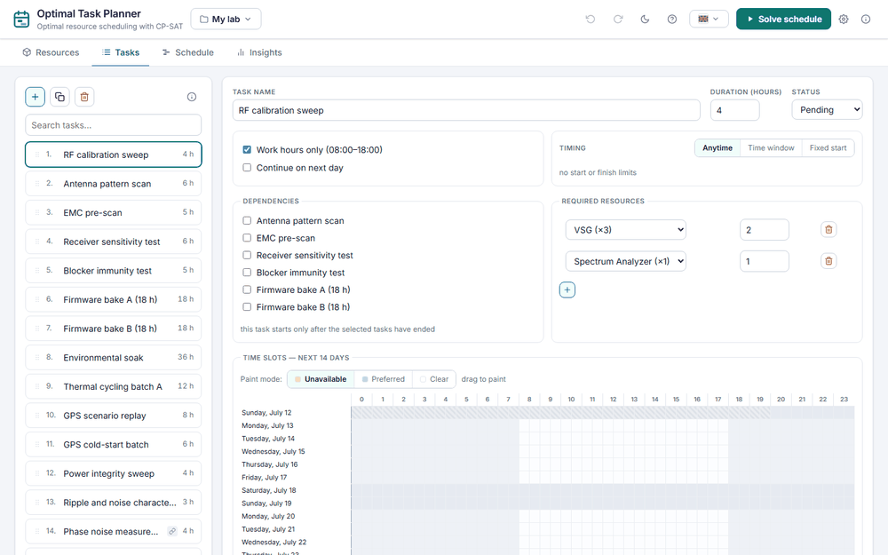
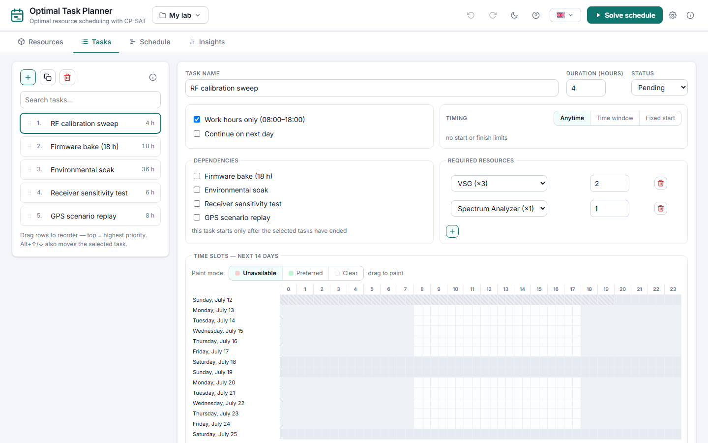
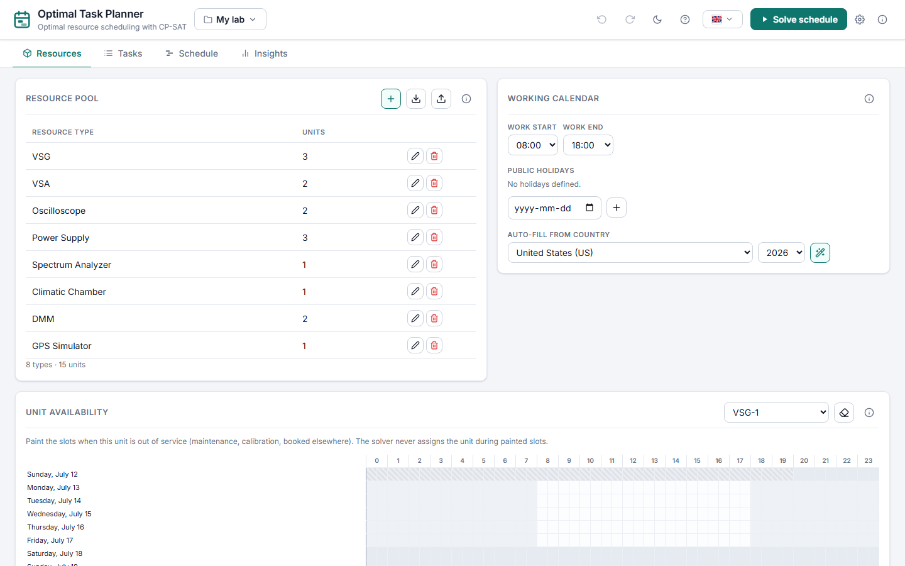
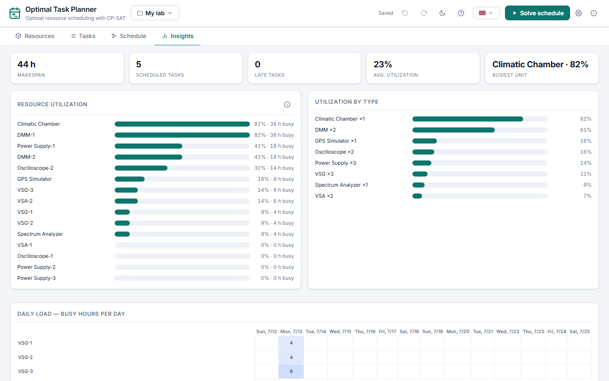
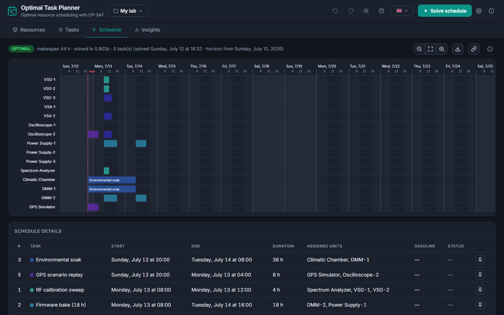
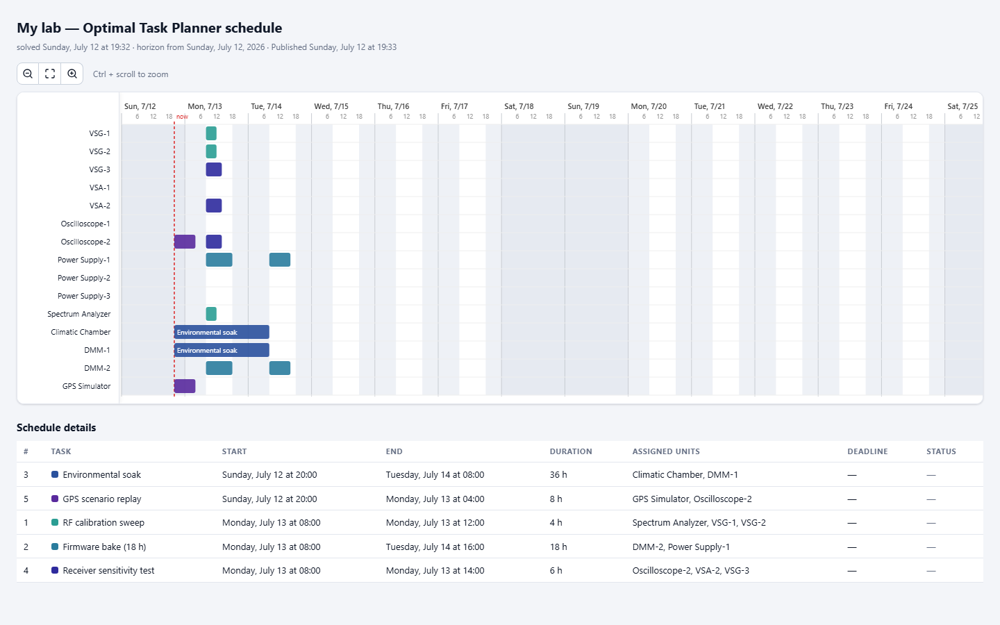

# Optimal Task Planner

[](https://github.com/Mavrikant/OptimalTaskPlanner/actions/workflows/ci.yml)
[](LICENSE)
[](pyproject.toml)

**Optimal resource scheduling over a rolling horizon, powered by
[Google OR-Tools CP-SAT](https://developers.google.com/optimization/cp/cp_solver).**

You describe your resource pool — equipment, staff, or both — your tasks and their
constraints, and Optimal Task Planner computes a provably optimal schedule and shows it
as an interactive Gantt chart. Everything runs locally: a small FastAPI backend plus a
dependency-free vanilla-JS frontend.


## Features

- **Optimal, not heuristic** — CP-SAT minimises makespan, then maximises preferred-slot
  usage, then respects task priority (lexicographic objective).
- **30-minute resolution** over a rolling horizon (14 days by default, configurable).
- **Rich task constraints** — duration, work-hours-only, continue-on-next-day splitting,
  hard deadlines, earliest and pinned starts, task dependencies, per-slot
  *preferred*/*unavailable* painting, drag-to-reorder priorities.
- **Re-planning aware** — mark tasks done or in-progress: the solver drops finished work
  and freezes running tasks on their current units and times while re-planning the rest.
  When nothing fits, the solver returns ranked hints naming which constraints to relax.
- **Responsive at scale** — solves run as cancellable background jobs with live progress
  (elapsed time and best makespan so far); the conflict model is pruned so large projects
  stay solvable. Time limit, parallel workers and horizon length are per-project settings.
- **Resource pool with per-unit availability** — equipment (e.g. `VSG-1`) or people
  (e.g. a named technician): mark a unit unavailable (maintenance, leave, a booking) and
  the solver will never assign it during that window. Units can carry custom names
  (serial numbers, brands, or a person's name) instead of automatic numbering.
- **Configurable working calendar** — work start/end times in 30-minute steps, plus public
  holidays: pick dates manually or auto-fill any country's official holidays
  (via the [`holidays`](https://pypi.org/project/holidays/) package).
- **Full-screen schedule view** — zoomable SVG Gantt with rich hover tooltips, a start/end
  details table, and a one-click export to a self-contained interactive HTML report that
  keeps the same zoom.
- **Shareable read-only link** — publish the current schedule to a stable
  `/share/<token>` URL that anyone who can reach the server can open (view-only, no
  editing UI). Republish after a re-solve to update the same link, unpublish any time.
  To share beyond your own machine, start the server with `--host 0.0.0.0`.
- **Insights** — a reporting tab derived from the solved schedule: KPI tiles (makespan, late
  tasks, average utilisation, busiest unit), per-unit and per-type utilisation bars, a
  units×days load heatmap, and bottleneck/deadline callouts.
- **Bilingual UI with dark mode** — English and Turkish out of the box; adding a language
  is one JSON file. Keyboard- and touch-friendly (focus traps, ARIA roles, pointer-event
  painting).
- **Multiple projects with data safety** — switch between named projects from the header,
  export/import them as JSON, undo/redo any change (Ctrl+Z/Y), and restore automatic
  backup snapshots. Data files are schema-versioned and migrate forward automatically.
- **Zero database** — every project is one human-readable JSON file under `data/projects/`.

## Tour



*Define your resource pool and tasks, hit **Solve schedule** and watch the Gantt update
live as CP-SAT finds better and better schedules ("best so far 286 h" → 94 h), explore
the result with hover tooltips, check utilisation in **Insights**, and publish a
read-only share link for your team.*

<details>
<summary><b>More screenshots</b> — Tasks, Resources, Insights, dark mode, and the shared schedule page</summary>
<br>

| Tasks — constraints & slot painting | Resources — pool, calendar & availability |
| --- | --- |
|  |  |

| Insights — utilisation & bottlenecks | Dark mode |
| --- | --- |
|  |  |

The published read-only page a share link opens — no editing UI, just the plan:



</details>

## Quick start

**Python users** — install from PyPI (or run without installing via [uv](https://docs.astral.sh/uv/)):

```bash
pip install optimal-task-planner     # or: pipx install optimal-task-planner
optimal-task-planner
```

```bash
uvx optimal-task-planner             # zero-install one-liner
```

The server starts, prints its data directory, and opens the UI in your browser
(<http://127.0.0.1:8000>). A sample project is created on first run.

**Docker** — run it as a small (LAN) server:

```bash
docker run -d -p 8000:8000 -v otp-data:/data ghcr.io/mavrikant/optimal-task-planner
```

or use the [docker-compose.yml](docker-compose.yml) in this repo: `docker compose up -d`.
Projects persist in the `/data` volume.

**Windows, no Python** — download `optimal-task-planner-X.Y.Z-windows-x64.exe`
from the [latest release](https://github.com/Mavrikant/OptimalTaskPlanner/releases/latest)
and double-click it. A console window shows the server log and the UI opens in
your browser. (The executable is unsigned, so SmartScreen may warn on first
run — choose "More info" → "Run anyway".)

**From a source checkout** (development):

```bash
python -m venv .venv
# Windows: .venv\Scripts\activate    Linux/macOS: source .venv/bin/activate
pip install -e .
optimal-task-planner
```

## Usage

1. **Resources tab** — define your resource types (equipment, people, or both) and unit
   counts, set working hours, add public holidays, and paint per-unit unavailability
   windows.
2. **Tasks tab** — add tasks, set durations and constraints, paint preferred/unavailable
   slots, and drag tasks to set priority (top = most important).
3. Press **Solve schedule** — the schedule opens full-screen with a Gantt chart per
   physical unit, hover tooltips, a details table and an *Export HTML* button.

## Configuration

Server-level settings come from CLI flags or environment variables:

| CLI flag     | Environment variable          | Default     | Description                     |
| ------------ | ----------------------------- | ----------- | ------------------------------- |
| `--host`     | `OPTIMAL_TASK_PLANNER_HOST`             | `127.0.0.1` | Bind address                    |
| `--port`     | `OPTIMAL_TASK_PLANNER_PORT`             | `8000`      | Port                            |
| `--data-dir` | `OPTIMAL_TASK_PLANNER_DATA_DIR`         | *(see below)* | Where projects & backups live |
| `--days`     | `OPTIMAL_TASK_PLANNER_DAYS`             | `14`        | Default horizon length for new projects |
| `--no-browser` | `OPTIMAL_TASK_PLANNER_NO_BROWSER`     | off         | Don't open the UI in a browser on startup |
| —            | `OPTIMAL_TASK_PLANNER_SOLVER_TIME_LIMIT`| `20`        | Default CP-SAT time limit for new projects (seconds) |

The default data directory is the per-user platform data dir —
`%LOCALAPPDATA%\optimal-task-planner` (Windows),
`~/.local/share/optimal-task-planner` (Linux),
`~/Library/Application Support/optimal-task-planner` (macOS) — unless a
`./data` directory already exists in the working directory (the pre-0.2
default), which then takes precedence. The resolved path is printed at
startup.

Horizon length, CP-SAT time limit and parallel workers are *project* settings (gear icon
next to **Solve**); new projects inherit the CLI/env defaults above. Working hours and
holidays are project settings too — everything lives in each project's JSON file.

## REST API

The UI talks to a small JSON API you can also use directly
(interactive docs at `/docs`):

| Method & path            | Description                                    |
| ------------------------ | ---------------------------------------------- |
| `GET /api/projects`      | List projects (id, name, updated)              |
| `POST /api/projects`     | Create a project `{name}`                      |
| `POST /api/projects/import` | Import a full project JSON as a new project |
| `PATCH /api/projects/{id}`  | Rename `{name}`                             |
| `DELETE /api/projects/{id}` | Delete (a final backup snapshot is kept)    |
| `POST /api/projects/{id}/duplicate` | Duplicate                           |
| `GET /api/projects/{id}` | Project data + horizon info                    |
| `PUT /api/projects/{id}` | Replace project data (validated)               |
| `POST /api/projects/{id}/solve` | Start a background solve, returns `{job_id}` |
| `GET /api/solve/{job_id}` | Solve status, progress and result when done   |
| `POST /api/solve/{job_id}/cancel` | Cancel a running solve (keeps best found) |
| `POST /api/projects/{id}/share` | Publish the schedule page, returns `{token, path}` |
| `DELETE /api/projects/{id}/share` | Unpublish the schedule page          |
| `GET /share/{token}`     | The published read-only schedule page          |
| `GET /api/projects/{id}/backups` | List automatic backup snapshots        |
| `POST /api/projects/{id}/backups/{name}/restore` | Restore a snapshot     |
| `GET /api/holidays/countries` | Countries supported for holiday auto-fill |
| `GET /api/holidays?country=TR&year=2026` | Official holidays for a country/year |
| `GET /api/health`        | Liveness + version                             |

## How it works

For every task the solver enumerates all feasible start slots together with the exact
set of 30-minute slots each start would occupy — this cleanly models work-hours-only
tasks and next-day continuation splits. CP-SAT then picks one start per task and assigns
physical units such that no unit is double-booked and no unit is used during its
unavailability windows. The objective is lexicographic through weighting:

1. minimise **makespan**,
2. maximise **preferred-slot** usage,
3. schedule higher-**priority** tasks earlier.

See [`src/optimal_task_planner/solver.py`](src/optimal_task_planner/solver.py) — the solver is a pure function
of the project data and an injected `now` timestamp, which keeps it fully unit-testable.

## Development

```bash
pip install -e .[dev]
ruff check .            # lint
ruff format --check .   # formatting
mypy                    # type check
pytest                  # tests
optimal-task-planner --reload
```

Contributions welcome — see [CONTRIBUTING.md](CONTRIBUTING.md). If you're an AI coding
agent (or configuring one), start with [AGENTS.md](AGENTS.md) for the repo map,
conventions and commands. Cutting a release? See [RELEASING.md](RELEASING.md).

## License

[MIT](LICENSE)
