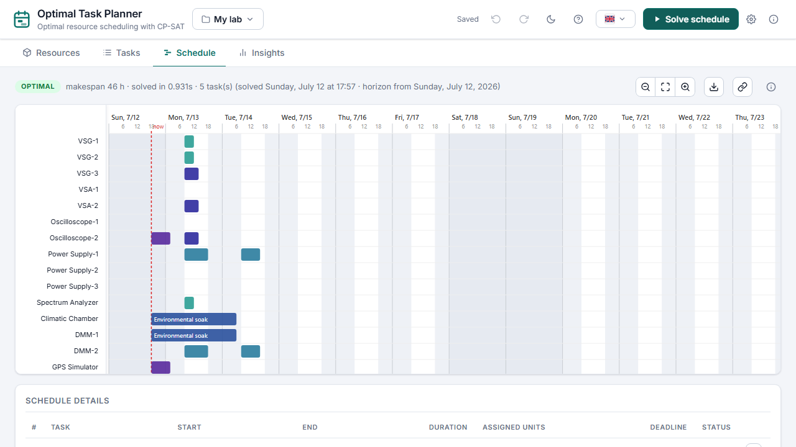

# LabPlanner

[](https://github.com/OWNER/labplanner/actions/workflows/ci.yml)
[](LICENSE)
[](pyproject.toml)

**Optimal lab equipment scheduling over a rolling horizon, powered by
[Google OR-Tools CP-SAT](https://developers.google.com/optimization/cp/cp_solver).**

You describe your equipment pool, your tasks and their constraints — LabPlanner computes a
provably optimal schedule and shows it as an interactive Gantt chart. Everything runs locally:
a small FastAPI backend plus a dependency-free vanilla-JS frontend.

<!-- TODO: replace with a real screenshot -->


## Features

- **Optimal, not heuristic** — CP-SAT minimises makespan, then maximises preferred-slot
  usage, then respects task priority (lexicographic objective).
- **30-minute resolution** over a rolling horizon (14 days by default, configurable).
- **Rich task constraints** — duration, work-hours-only, continue-on-next-day splitting,
  hard deadlines, earliest and pinned starts, task dependencies, per-slot
  *preferred*/*unavailable* painting, drag-to-reorder priorities.
- **Re-planning aware** — mark tasks done or in-progress: the solver drops finished work
  and freezes running tasks on their current units and times while re-planning the rest.
  When nothing fits, the solver returns ranked hints naming which constraints to relax.
- **Responsive at scale** — solves run as cancellable background jobs with live progress
  (elapsed time and best makespan so far); the conflict model is pruned so large projects
  stay solvable. Time limit, parallel workers and horizon length are per-project settings.
- **Equipment pool with per-unit availability** — mark an individual unit (e.g. `VSG-1`)
  as under maintenance and the solver will never assign it during that window. Units can
  carry custom names (serial numbers, brands) instead of automatic numbering.
- **Configurable working calendar** — work start/end times in 30-minute steps, plus public
  holidays: pick dates manually or auto-fill any country's official holidays
  (via the [`holidays`](https://pypi.org/project/holidays/) package).
- **Full-screen schedule view** — zoomable SVG Gantt with rich hover tooltips, a start/end
  details table, and a one-click export to a self-contained interactive HTML report that
  keeps the same zoom.
- **Insights** — a reporting tab derived from the solved schedule: KPI tiles (makespan, late
  tasks, average utilisation, busiest unit), per-unit and per-type utilisation bars, a
  units×days load heatmap, and bottleneck/deadline callouts.
- **Bilingual UI with dark mode** — English and Turkish out of the box; adding a language
  is one JSON file. Keyboard- and touch-friendly (focus traps, ARIA roles, pointer-event
  painting).
- **Multiple projects with data safety** — switch between named projects from the header,
  export/import them as JSON, undo/redo any change (Ctrl+Z/Y), and restore automatic
  backup snapshots. Data files are schema-versioned and migrate forward automatically.
- **Zero database** — every project is one human-readable JSON file under `data/projects/`.

## Quick start

```bash
pip install git+https://github.com/OWNER/labplanner.git
labplanner
```

Then open <http://127.0.0.1:8000>. A sample project is created on first run.

From a source checkout:

```bash
python -m venv .venv
# Windows: .venv\Scripts\activate    Linux/macOS: source .venv/bin/activate
pip install -e .
labplanner
```

## Usage

1. **Resources tab** — define your equipment types and unit counts, set working hours,
   add public holidays, and paint per-unit maintenance windows.
2. **Tasks tab** — add tasks, set durations and constraints, paint preferred/unavailable
   slots, and drag tasks to set priority (top = most important).
3. Press **Solve schedule** — the schedule opens full-screen with a Gantt chart per
   physical unit, hover tooltips, a details table and an *Export HTML* button.

## Configuration

Server-level settings come from CLI flags or environment variables:

| CLI flag     | Environment variable          | Default     | Description                     |
| ------------ | ----------------------------- | ----------- | ------------------------------- |
| `--host`     | `LABPLANNER_HOST`             | `127.0.0.1` | Bind address                    |
| `--port`     | `LABPLANNER_PORT`             | `8000`      | Port                            |
| `--data-dir` | `LABPLANNER_DATA_DIR`         | `./data`    | Where projects & backups live   |
| `--days`     | `LABPLANNER_DAYS`             | `14`        | Default horizon length for new projects |
| —            | `LABPLANNER_SOLVER_TIME_LIMIT`| `20`        | Default CP-SAT time limit for new projects (seconds) |

Horizon length, CP-SAT time limit and parallel workers are *project* settings (gear icon
next to **Solve**); new projects inherit the CLI/env defaults above. Working hours and
holidays are project settings too — everything lives in each project's JSON file.

## REST API

The UI talks to a small JSON API you can also use directly
(interactive docs at `/docs`):

| Method & path            | Description                                    |
| ------------------------ | ---------------------------------------------- |
| `GET /api/projects`      | List projects (id, name, updated)              |
| `POST /api/projects`     | Create a project `{name}`                      |
| `POST /api/projects/import` | Import a full project JSON as a new project |
| `PATCH /api/projects/{id}`  | Rename `{name}`                             |
| `DELETE /api/projects/{id}` | Delete (a final backup snapshot is kept)    |
| `POST /api/projects/{id}/duplicate` | Duplicate                           |
| `GET /api/projects/{id}` | Project data + horizon info                    |
| `PUT /api/projects/{id}` | Replace project data (validated)               |
| `POST /api/projects/{id}/solve` | Start a background solve, returns `{job_id}` |
| `GET /api/solve/{job_id}` | Solve status, progress and result when done   |
| `POST /api/solve/{job_id}/cancel` | Cancel a running solve (keeps best found) |
| `GET /api/projects/{id}/backups` | List automatic backup snapshots        |
| `POST /api/projects/{id}/backups/{name}/restore` | Restore a snapshot     |
| `GET /api/holidays/countries` | Countries supported for holiday auto-fill |
| `GET /api/holidays?country=TR&year=2026` | Official holidays for a country/year |
| `GET /api/health`        | Liveness + version                             |

## How it works

For every task the solver enumerates all feasible start slots together with the exact
set of 30-minute slots each start would occupy — this cleanly models work-hours-only
tasks and next-day continuation splits. CP-SAT then picks one start per task and assigns
physical units such that no unit is double-booked and no unit is used during its
unavailability windows. The objective is lexicographic through weighting:

1. minimise **makespan**,
2. maximise **preferred-slot** usage,
3. schedule higher-**priority** tasks earlier.

See [`src/labplanner/solver.py`](src/labplanner/solver.py) — the solver is a pure function
of the project data and an injected `now` timestamp, which keeps it fully unit-testable.

## Development

```bash
pip install -e .[dev]
ruff check .   # lint
pytest         # tests
labplanner --reload
```

Contributions welcome — see [CONTRIBUTING.md](CONTRIBUTING.md).

## License

[MIT](LICENSE)
